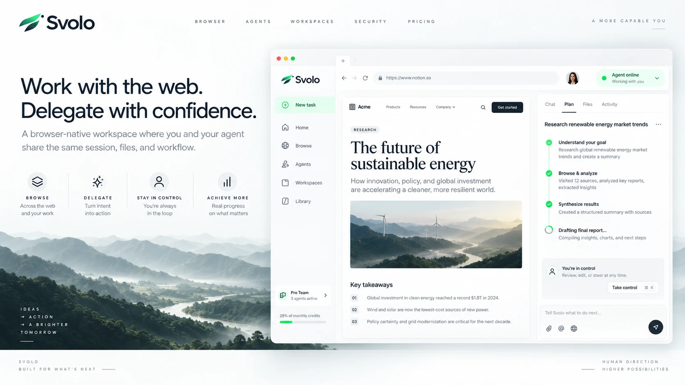

<p align="center"></p>
<p align="center"><strong>You set the direction. Svolo gets the work done.</strong></p>

# Browser, agenti e workspace nello stesso ambiente

Svolo mette nella stessa applicazione navigazione interattiva, attività degli agenti,
file di progetto e host remoti. Il controllo può passare dall'agente all'utente senza
aprire una seconda copia della pagina. Il core Go gestisce strumenti, autorizzazioni
e servizi; il desktop Electron/React presenta schede, chat e workflow.


*Illustrazione di prodotto approvata: rappresenta la direzione visiva, non uno screenshot di una build eseguita.*

## Stato della distribuzione

**0.3.1-dev — distribuzione sorgente per sviluppo e verifica.** Non è una release
certificata per la produzione. Il browser desktop implementato usa Electron;
non viene distribuito un host CEF. I moduli sperimentali non sono dichiarati
funzioni disponibili solo perché compaiono nel sorgente.

La [verifica corrente](../verification.json) distingue controlli eseguiti, risultati
e verifiche non eseguite. I [requisiti di rilascio](docs/RELEASE.md) rimangono vincolanti.

## Cosa comprende

| Area | Capacità del progetto |
| --- | --- |
| Browser | Schede, profili gestiti, lettura semantica, input, screenshot, controlli responsive, rete, download e registrazioni campionate. |
| Agenti | Provider configurabili, immagini quando il modello le supporta, streaming, strumenti con approvazione, interruzione e stato persistente. |
| Workspace | File confinati al progetto, trasferimenti verificati, Kanban, segnalazioni, Git/worktree e pianificazione ATP. |
| Host | Esecuzione locale, configurazione multi-host e collegamenti OpenSSH verso daemon remoti. |
| Integrazioni | Client MCP per strumenti esterni, server MCP con token limitati alla sessione, runtime pi opzionale per il desktop. |
| Protezioni | Autenticazione locale, vault delle credenziali, separazione dei controlli amministrativi e autorizzazioni per le applicazioni native. |

Il [catalogo degli strumenti](../../schemas/tools.json) è generato dalle definizioni
eseguibili. Le [capacità e i limiti](../capabilities.json) descrivono quali moduli
sono collegati all'applicazione e quali richiedono integrazione ulteriore.

## Avviare il core

Richiede Go 1.23 o successivo. Per navigare serve anche Chromium/Chrome installato.
Eseguire come utente normale, non come amministratore del sistema.

```bash
mkdir -p build
cd core
go build -trimpath -o ../build/svolo-core ./cmd/svolo-core
../build/svolo-core serve --data "$HOME/.local/share/svolo/core" --listen 127.0.0.1:7331
```

Aprire `http://127.0.0.1:7331`. Il processo stampa il percorso del file `auth.token`:
il token si legge localmente e si inserisce nella schermata di accesso. Non pubblicare
il token e non collocare la cartella dati in un workspace accessibile all'agente.
L'avvio non richiede un account AI; una sessione agente richiede un provider configurato.

Per Windows, macOS, desktop e dipendenze native: [primo avvio](docs/GETTING_STARTED.md).

## Avviare il desktop

```bash
cd desktop
corepack enable
pnpm install --frozen-lockfile
pnpm typecheck
pnpm test
pnpm dev
```

Versione del package manager e dipendenze sono fissate nel manifest e nel lockfile.
L'installazione richiede accesso al registro dei pacchetti. Il runtime `pi` è esterno:
la console del core può essere utilizzata senza installarlo.

## Gateway web Linux

Il servizio in `web/` offre accesso HTTPS con login, chat e browser integrato,
impostazioni provider/MCP e gestione degli utenti. Ogni account usa un core
separato in Bubblewrap, con profili e workspace privati. Credenziali e prompt
del gateway sono cifrati; il backup deve includere anche gli store dei core
e conservare la master key separatamente.

Il gateway richiede Node.js con `node:sqlite`, Chromium, Bubblewrap e un core
Go compilato. Ascolta sul loopback e viene esposto tramite proxy/tunnel HTTPS:
seguire [installazione e verifiche web](docs/WEB_DEPLOYMENT.md),
[API web](docs/WEB_API.md) e [sicurezza web](docs/WEB_SECURITY.md).
Il servizio Linux è distinto dalla distribuzione desktop e rimane in sviluppo,
con `productionQualified:false`; i provider esterni richiedono verifiche live
dei singoli protocolli e le quote non disponibili sono indicate come tali.

## Documentazione

[Guida utente](docs/USER_GUIDE.md) · [Architettura](docs/ARCHITECTURE.md) ·
[Configurazione](docs/CONFIGURATION.md) · [API](docs/API.md) ·
[Host remoti](docs/REMOTE_HOSTS.md) · [Sicurezza](docs/SECURITY.md) ·
[Sviluppo e test](docs/DEVELOPMENT.md) · [Brand](brand/README.md)

[Deploy web](docs/WEB_DEPLOYMENT.md) · [API web](docs/WEB_API.md) ·
[Sicurezza web](docs/WEB_SECURITY.md) · [Frontend web](docs/frontend-web.md) ·
[Provider web](docs/web-providers.md) · [Harness assistente](docs/AGENT_HARNESS.md)

## Licenza

[0xfunboy Non-Commercial License](../../LICENSE.md), versione 1.1: uso commerciale solo
con autorizzazione scritta. Le eccezioni applicabili ai componenti sono raccolte in
[legal/NOTICE.md](../../legal/NOTICE.md), separatamente dalla documentazione di prodotto.
